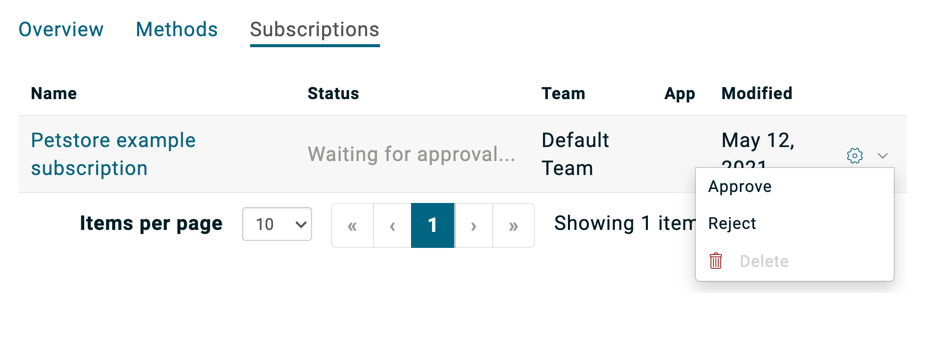

# Subscription
The subscription mechanism provided by the Discovery Agent can be used to create a client application and a contract on MuleSoft for an already discovered MuleSoft API. Currently, the below authentication policies are supported:
1. Client ID Enforcement
2. Rate Limiting - SLA based Policy

# Pre-requitites
1. MuleSoft Discovery Agent needs to be up and running
2. At least one API exists on MuleSoft that has been configured with one of the above policies

# Example

## Subscribe
1. Say you have an API on MuleSoft that has been configured with Rate Limiting - SLA based Policy along with SLA Tiers that are configured with auto-approval. MuleSoft Discovery agent picks this up and creates a few resources on Amplify, and one of them is the Catalog item.


2. Clicking on the catalog item takes you to its detail page where you click the Subscribe button on the top-right corner 


3. Fill out the requested details on the pop-up modal


4. Ask someone who has Platform administrator role on Amplify to approve the subscription request



5. Depending on the interval set for polling subscriptions on Central, wait until the subscription is active


6. Refresh the page and verify that the subscription is activated


7. Click on the subscription name and it takes you to the subscription detail page. Here you can access the client ID and client secret and invoke the Proxy endpoint

```shell
curl -v http://<MuleSoft_Proxy_URL>/store/inventory -H "client_id:<Value_from_subscription>" -H "client_secret:<Value_from_subscription>"
```

## Unsubscribe

1. Click on the Unsubscribe option that appears after clicking on the subscription's cog icon


2. Wait until the request to unsubscribe is processed


3. Refresh the page and verify that the subscription is no longer active


