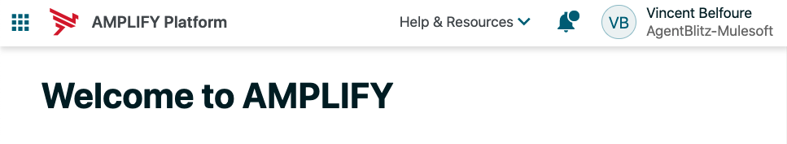
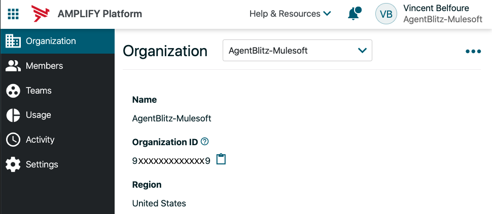
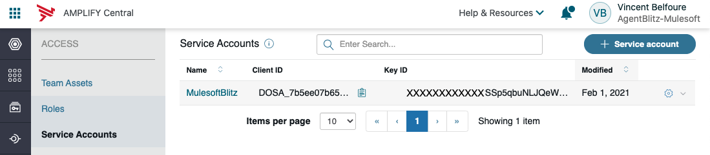
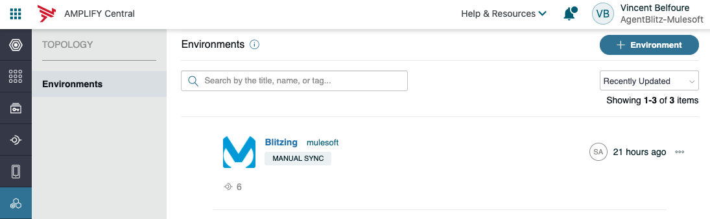

# Prerequisite
1. Golang 
2. Make
3. Axway Amplify account

# Configure Axway Amplify 

Navigate to https://platform.axway.com and authenticate or sign up for a trial account

## Locate Amplify Organization ID




Click on your profile in the top-right corner of the Welcome screen and select *Organization*




Note the value of the Organization ID

## Create a Service Account
Service Account are used by Amplify so that the Agents can connect to the Gateway without exposing client credentials

Click the grid icon at the top-left of the UI and select *Central*

Navigate to *Access -> Service Accounts*

Click the `+Service Account` Button

Add a name and a public key

To generate a public key, you can install OpenSSL and run the commands:

`openssl genpkey -algorithm RSA -out private_key.pem -pkeyopt rsa_keygen_bits:2048

openssl rsa -pubout -in private_key.pem -out public_key.pem`



Note the Client ID and Key ID values.

## Create Environment
The environment will represent the connected Mulesoft API Gateway within the Amplify platform

Navigate to the Toplogy tab and clicn the `+Environment` Button

Complete the configuration form, noting the value entered in the Name field. It must be all lowercase with no spaces as it will be used as an identifier to the agent configuration later.




# Steps to implement discovery agent using this stub
1. Locate the commented tag "CHANGE_HERE" for package import paths in all files and fix them to reference the path correctly.
2. Run "make dep" to resolve the dependencies. This should resolve all dependency packages and vendor them under ./vendor directory
3. Update Makefile to change the name of generated binary image from *apic_discovery_agent* to the desired name. Locate *apic_discovery_agent* string and replace with desired name
4. Update pkg/cmd/root.go to change the name and description of the agent. Locate *apic_discovery_agent* and *Sample Discovery Agent* and replace to desired values
5. Update pkg/config/config.go to define the gateway specific configuration
    - Locate *gateway-section* and replace with the name of your gateway. Same string in pkg/cmd/root.go and sample YAML config file
    - Define gateway specific config properties in *GatewayConfig* struct. Locate the struct variables *ConfigKey1* & struct *config_key_1* and add/replace desired config properties
    - Add config validation. Locate *ValidateCfg()* method and update the implementation to add validation specific to gateway specific config.
    - Update the config binding with command line flags in init(). Locate *gateway-section.config_key_1* and add replace desired config property bindings
    - Update the initialization of gateway specific by parsing the binded properties. Locate *ConfigKey1* & *gateway-section.config_key_1* and add/replace desired config properties
6. Update pkg/gateway/client.go to implement the logic to discover and fetch the details related of the APIs.
    - Locate *DiscoverAPIs()* method and implement the logic
    - Locate *buildServiceBody()* method and update the Set*() method according to the API definition from gateway
7. Run "make build" to build the agent
8. Rename *apic_discovery_agent.yaml* file to the desired agents name and setup the agent config in the file.
9. Execute the agent by running the binary file generated under *bin* directory. The YAML config must be in the current working directory

Example *apic_discover_agent.yaml* file

```
central:
  organizationID: [Located in Amplify Central Organization]
  environment: [Located in Amplify Central topology]
  auth:
    clientID: [Located in the Amplify Central Access/Service Accounts]
    privateKey: [Private Key path you used to create the Access/Service Accounts]
    publicKey: [Public Key path you used to create the Access/Service Accounts]

 

mulesoft:
 anypointExchangeUrl: https://anypoint.mulesoft.com
 environment: Sandbox
 auth:
  username: [Mulesoft username]
  password: [Mulesoft password]
  lifetime: 60m
  ```

# Start the Discovery Agent

```
./mulesoft_discovery_agent --pathConfig <path to apic_discovery_agent.yaml>
```
Reference: [SDK Documentation - Building Discovery Agent](https://github.com/Axway/agent-sdk/blob/main/docs/discovery/index.md)
